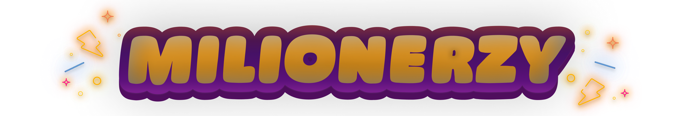
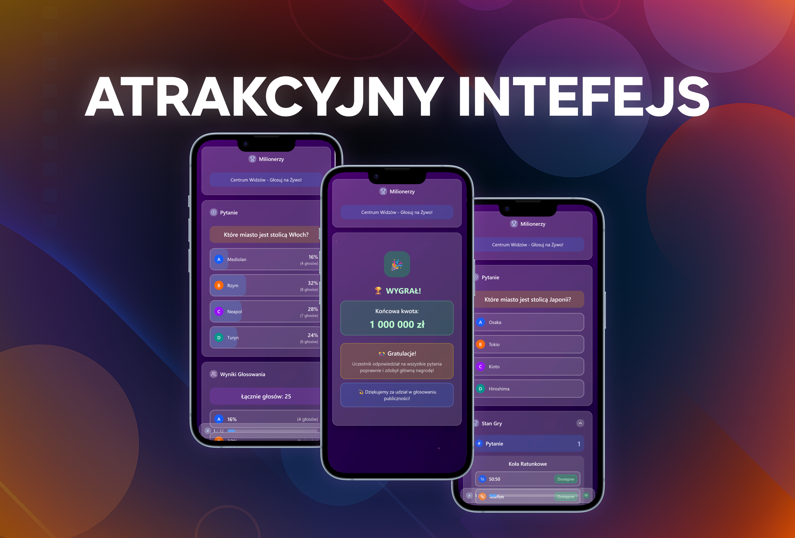
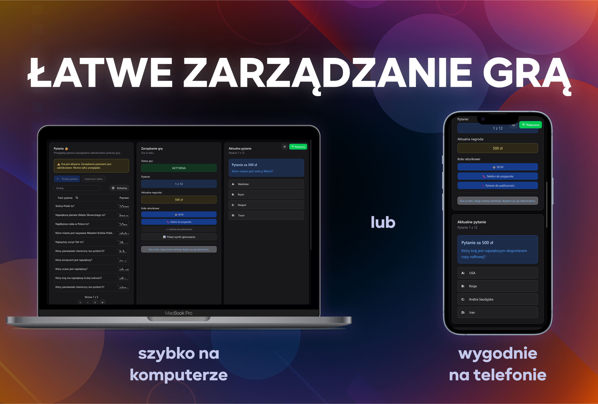
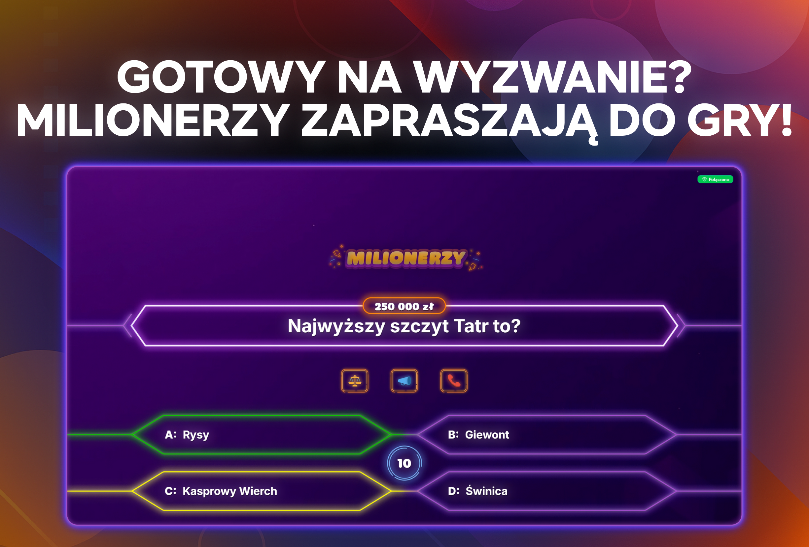
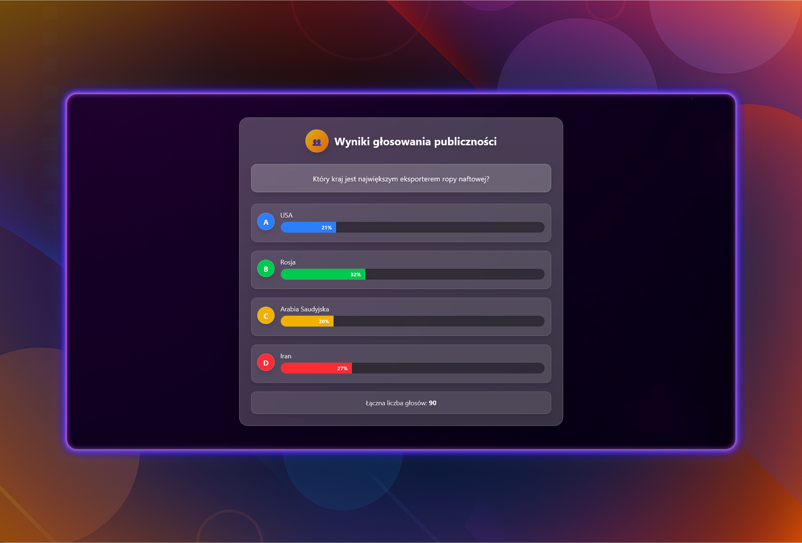
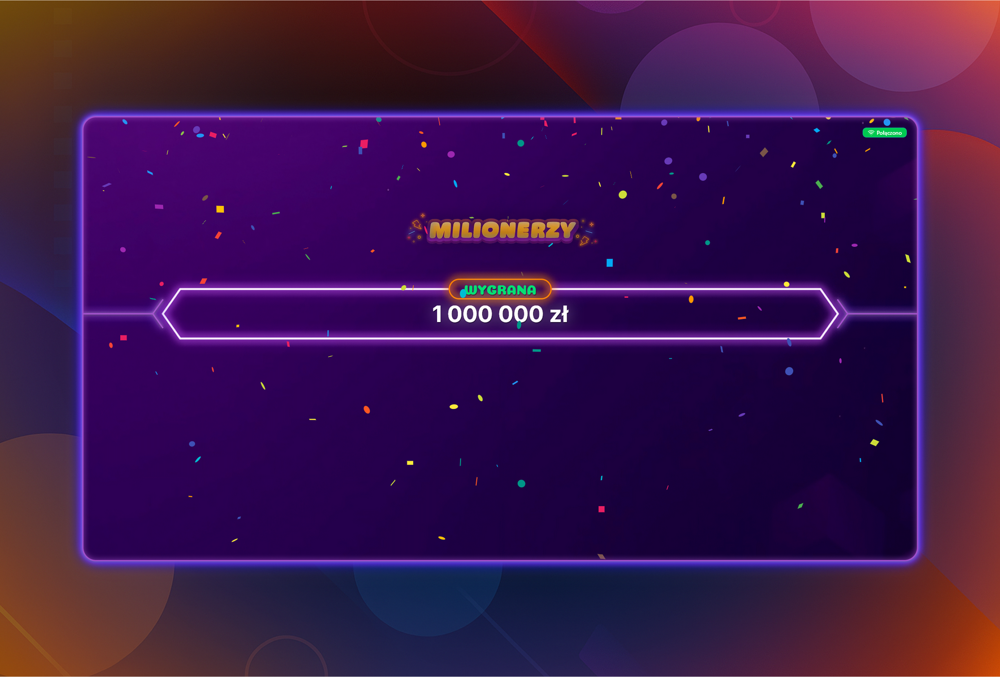

- 

# 🎓 Milionerzy – Aplikacja Webowa do Przeprowadzania Teleturniejów Szkolnych

Nowoczesna aplikacja quizowa wzorowana na kultowym teleturnieju „Milionerzy", stworzona specjalnie z myślą o przeprowadzaniu konkursów wiedzy na auli szkolnej. System składa się z trzech modułów komunikujących się w czasie rzeczywistym, zapewniając profesjonalne i atrakcyjne przeprowadzenie teleturnieju w warunkach szkolnych.

## 📷 Zrzuty ekranu

- 
- 
- 
- 
- 

## ✨ Kluczowe zalety

- **💻 Działanie offline** – Aplikacja działa w sieci lokalnej bez dostępu do internetu
- **⚡ Komunikacja w czasie rzeczywistym** – Wykorzystanie technologii Server-Sent Events (SSE)
- **🎯 Trzy moduły** – Ekran główny, panel administratora i interfejs publiczności
- **🎨 Profesjonalny wygląd** – Atrakcyjny interfejs nadający charakter prawdziwego teleturnieju
- **👥 Interaktywność** – Aktywny udział publiczności w grze

## 🛠 Technologie

- [Next.js 15](https://nextjs.org/) z App Router
- [TypeScript](https://www.typescriptlang.org/)
- [Tailwind CSS](https://tailwindcss.com/)
- [shadcn/ui](https://ui.shadcn.com/)
- [Prisma](https://www.prisma.io/)
- **Server-Sent Events (SSE)** do komunikacji w czasie rzeczywistym

## 🖥 Moduły systemu

### 👨‍💼 Panel administratora (`/admin`)

**Centrum zarządzania teleturniejem** dla prowadzącego:

- Zarządzanie bazą pytań (dodawanie, edycja, import)
- Konfiguracja gry
- Sterowanie przebiegiem gry w czasie rzeczywistym
- Zatwierdzanie odpowiedzi uczestników
- Obsługa wszystkich kół ratunkowych
- Podgląd stanu gry i historii odpowiedzi

### 🎮 Widok gracza (`/player`)

**Interfejs dla uczestnika teleturnieju**:

- Wyświetlanie aktualnego pytania i odpowiedzi
- Dostęp do kół ratunkowych (50:50, telefon do przyjaciela, pytanie do publiczności)
- Podgląd drabinki nagród z oznaczeniem aktualnej pozycji
- Wskaźniki statusu gry

### 👥 Moduł publiczności (`/vote`)

**Aktywny udział widowni w teleturnieju**:

- Podgląd aktualnego pytania podczas głosowania
- Interfejs do głosowania w kole "pytanie do publiczności"
- Wyświetlanie wyników głosowania w czasie rzeczywistym
- Informacje o stanie gry dla publiczności

## 🚀 Nowatorstwo projektu

Projekt wprowadza nowoczesną architekturę klient-serwer z komunikacją w czasie rzeczywistym opartą na technologii **Server-Sent Events (SSE)**. W przeciwieństwie do dostępnych dotychczas rozwiązań, które często opierały się na prymitywnych i mało stabilnych mechanizmach, nowa wersja została zaprojektowana do pracy w sieci lokalnej, całkowicie offline.

**Kluczowe innowacje:**

- **Stabilna komunikacja w czasie rzeczywistym** bez ryzyka przerw internetowych
- **Modułowa architektura** umożliwiająca łatwą rozbudowę
- **Profesjonalne podejście do UI/UX** łączące wysoką niezawodność z łatwością obsługi
- **Interaktywność publiczności** jako integralny element systemu

## 🎯 Zastosowanie praktyczne

Aplikacja znajduje szerokie zastosowanie w środowisku szkolnym:

### 📚 Wydarzenia edukacyjne

- Konkursy wiedzy na różnych przedmiotach
- Dni tematyczne i interdyscyplinarne projekty
- Dni otwarte i prezentacje szkoły
- Urozmaicenie zajęć dydaktycznych

### 🏆 Korzyści dla uczniów

- Rozwój logicznego myślenia i szybkiego podejmowania decyzji
- Zwiększenie zaangażowania w naukę przez element zabawy
- Możliwość aktywnego udziału publiczności
- Budowanie pewności siebie i umiejętności wystąpień publicznych

### 🎪 Atrakcyjność wydarzeń

- Profesjonalny charakter zbliżony do telewizyjnego teleturnieju
- Angażowanie całej widowni, nie tylko uczestników
- Stabilne działanie niezależne od infrastruktury internetowej
- Łatwość obsługi dla nauczycieli i organizatorów

## 🌟 Znaczenie dla placówki edukacyjnej

System wprowadza nowoczesną formę interaktywnych zajęć, która:

- **Zwiększa atrakcyjność** wydarzeń szkolnych i zaangażowanie uczniów
- **Prezentuje nowoczesne technologie** w praktycznym zastosowaniu
- **Inspiruje** nauczycieli i uczniów do tworzenia własnych narzędzi edukacyjnych
- **Wspiera rozwój** innowacyjnych form nauki i zabawy
- **Umożliwia organizację** profesjonalnych teleturniejów bez kosztów zewnętrznych

## 🔮 Możliwości rozwoju

### 🎮 Nowe tryby gry

- **Moduł eliminacji** – szybkie uporządkowanie pytań przez uczestników
- **Rozgrywka wieloosobowa** – kilku uczestników jednocześnie

### 🤖 Funkcje zaawansowane

- **Integracja z AI** - do wyjaśniania poprawnych odpowiedzi
- **System personalizacji** – różne motywy wizualne dla różnych wydarzeń

### 📊 Dodatkowe moduły

- Generator raportów z przeprowadzonych gier
- System zarządzania uczestnikami i klasami
- Biblioteka gotowych zestawów pytań tematycznych
- Moduł treningowy dla uczniów

## 🎈 Dodatkowe zalety

- **💡 Rozwój kompetencji miękkich** – logiczne myślenie, współpraca, prezentacja
- **🎭 Połączenie edukacji z rozrywką** zwiększające motywację do nauki
- **🔧 Modułowość i skalowalność** ułatwiające przyszłe rozszerzenia
- **👨‍👩‍👧‍👦 Włączenie społeczności** poprzez udział publiczności w czasie rzeczywistym

## 🚀 Instalacja i uruchomienie

### Wymagania systemowe

- Node.js 18.17 lub nowszy
- npm lub yarn
- Przeglądarka internetowa (Chrome, Firefox, Edge)

### Kroki instalacji

1. **Klonowanie repozytorium**

```bash
git clone https://github.com/krzx000/milionerzy.git
cd milionerzy
```

2. **Instalacja zależności**

```bash
npm install
```

3. **Konfiguracja bazy danych**

```bash
npx prisma generate
npx prisma db push
npx prisma db seed
```

4. **Uruchomienie aplikacji**

```bash
npm run dev
```

5. **Dostęp do modułów**

- Ekran główny: `http://localhost:3000`
- Panel administratora: `http://localhost:3000/admin`
- Widok gracza: `http://localhost:3000/player`
- Moduł publiczności: `http://localhost:3000/vote`

### Konfiguracja sieci lokalnej

Aby umożliwić dostęp z innych urządzeń w sieci lokalnej:

1. Znajdź adres IP swojego komputera
2. Uruchom aplikację z flagą host:

```bash
npm run dev -- --host 0.0.0.0
```

3. Inne urządzenia mogą się połączyć używając: `http://[TWOJ-IP]:3000`

## 📝 Licencja

Projekt stworzony w celach edukacyjnych. Wszelkie prawa do nazwy i koncepcji "Milionerzy" należą do odpowiednich właścicieli.

---

_Projekt realizowany w ramach działalności innowacyjnej w środowisku szkolnym, łączącej nowoczesne technologie z praktyką edukacyjną._
